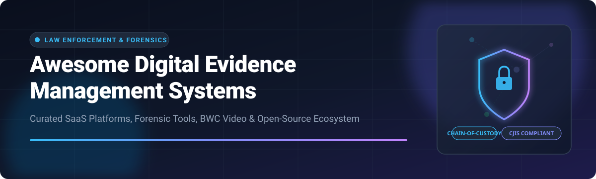

  

  
  
  
  
  
  

---

# 🚀 Top Digital Evidence Management Ecosystem (DEMS) ⚖️

> **A curated, SEO-optimized directory of commercial SaaS platforms & open-source GitHub projects for Digital Evidence Management Systems (DEMS), Body-Worn Camera (BWC) evidence, Chain of Custody logging, AI Video Redaction, and Digital Forensics.**

---

## 📌 Table of Contents 📖
- [🔍 Overview & Industry Analysis](#-overview--industry-analysis)
- [🏢 SaaS & Commercial Platforms](#-saas--commercial-platforms)
- [🔓 Open-Source GitHub Projects](#-open-source-github-projects)
- [🤝 How to Contribute](#-how-to-contribute)
- [⚠️ Disclaimer & Compliance](#️-disclaimer--compliance)
- [💖 Support & Sponsorship](#-support--sponsorship-)
- [📈 Star History](#-star-history)

---

## 🔍 Overview & Industry Analysis 📊

**Digital Evidence Management Systems (DEMS)** enable law enforcement agencies, prosecutors, defense attorneys, and corporate forensic units to securely ingest, analyze, redact, audit, and exchange digital evidence (Body-Worn Camera footage, CCTV video, in-car audio, mobile extractions, and digital documents) with strict **CJIS-compliant chain-of-custody tracking**.

---

## 🏢 SaaS & Commercial Platforms 💼

📊 **Market Insights**: The global Digital Evidence Management Systems (DEMS) market size is estimated at **$7.8 Billion in 2026** (projected to reach $15.2 Billion by 2032 at a CAGR of 11.8%). The market is **moderately concentrated** with dominant leaders like Axon Enterprise and Motorola Solutions holding major market share due to hardware-software integration, CJIS compliance barriers, and agency lock-in.

### 📊 Commercial DEMS Vendor Comparison

| 🏢 Platform / SaaS Product | 💰 Company Size (Valuation / Revenue) | 🏷️ Pricing (Starting Tier) | 🎁 Free Tier / Trial Limits | 📋 Primary Features & Best For |
| :--- | :--- | :--- | :--- | :--- |
| **[Motorola CommandCentral Evidence](https://www.motorolasolutions.com/)** | **$78.0 Billion** Valuation ($10.0B Revenue) | **$25 / user / month** | **30-day agency evaluation trial** (Includes 50 GB storage & 5 user seats) | Enterprise public safety ecosystem, BWC ingest, multi-agency investigation assembly. |
| **[Axon Evidence (Evidence.com)](https://www.axon.com/products/axon-evidence)** | **$28.5 Billion** Valuation ($1.56B Revenue) | **$15 / user / month** (Basic) | **30-day agency pilot trial** (Includes free camera trial kit & unlimited test storage) | Global market leader for BWC & in-car video, automated redaction & CJIS compliance. |
| **[NICE Investigate](https://www.nice.com/)** | **$10.8 Billion** Valuation ($2.37B Revenue) | **$30 / user / month** | **30-day guided agency pilot** (Up to 10 investigator accounts & 100 GB storage) | Automated criminal investigation assembly, digital court portal & evidence sharing. |
| **[Safe Fleet DEMS / Focus](https://www.safefleet.net/)** | **$6.2 Billion** Parent Valuation ($1.15B Acq.) | **$20 / user / month** | **30-day agency trial program** (Includes 25 GB storage & 3 evaluator seats) | Fleet & body-worn video evidence management for law enforcement & transit agencies. |
| **[Genetec Clearance](https://www.genetec.com/products/evidence-management/clearance)** | **$500 Million** Est. Revenue (Private) | **$18 / user / month** | **45-day free trial** (Up to 5 user seats & 100 GB cloud storage) | Collaborative digital evidence management, multi-agency sharing & automated redaction. |
| **[Veritone iDEMS / Redact](https://www.veritone.com/)** | **$120 Million** Valuation ($127M Revenue) | **$99 / month** (Redact Starter) | **14-day free trial** (Includes 60 minutes of AI video/audio redaction) | AI-powered audio/video redaction, face/object detection & multi-media processing. |
| **[VIDIZMO DEMS](https://www.vidizmo.com/digital-evidence-management-system/)** | **$15 Million** Est. Revenue (Private) | **$15 / user / month** | **14-day free trial** (Full DEMS access, 100 GB storage & 5 test accounts) | Secure cloud DEMS, prosecutor sharing portal, CJIS compliance & video redaction. |
| **[FileOnQ Digital Evidence Manager](https://fileonq.com/)** | **$8 Million** Est. Revenue (Private) | **$12 / user / month** | **30-day live software demo & trial** (Custom workflow evaluation) | Physical & digital evidence integration, barcode chain-of-custody tracking & discovery. |

---

## 🔓 Open-Source GitHub Projects 🛠️

While full-suite end-to-end BWC DEMS platforms are primarily commercial due to CJIS certifications and hardware ingest integrations, high-performance open-source building blocks powers forensic labs, incident response teams, object storage backends, and immutable audit logs.

### 🌟 Top Open-Source Projects (Sorted by GitHub_Stars ⭐️)

| 🛠️ Project Name & Repository | ⭐️ GitHub_Stars | 📝 Category & Description |
| :--- | :--- | :--- |
| **[MinIO Object Storage](https://github.com/minio/minio)** |  | **Storage Backend**: High-performance S3-compatible object store widely deployed as encrypted evidence vaults. |
| **[Nextcloud Server](https://github.com/nextcloud/server)** |  | **Secure Collaboration**: Self-hosted file sync & sharing platform with file audit logs for secure internal evidence exchange. |
| **[CyberChef](https://github.com/gchq/CyberChef)** |  | **Data Analysis**: The Cyber Swiss Army Knife for encoding, decoding, data extraction & cryptographic evidence analysis. |
| **[MISP Threat Platform](https://github.com/MISP/MISP)** |  | **Threat & Evidence Sharing**: Open source threat intelligence and digital indicator sharing platform. |
| **[GRR Rapid Response](https://github.com/google/grr)** |  | **Remote Forensics**: Incident response and live digital forensic evidence gathering framework scalable to thousands of hosts. |
| **[Volatility 3](https://github.com/volatilityfoundation/volatility3)** |  | **Memory Forensics**: Advanced memory extraction and volatile artifact investigation framework. |
| **[Velociraptor](https://github.com/Velocidex/velociraptor)** |  | **Endpoint Forensics**: Digital forensic target monitoring, endpoint hunting, and evidence collection engine. |
| **[TheHive](https://github.com/TheHive-Project/TheHive)** |  | **Case Management**: Collaborative security incident response and investigation case management system. |
| **[Timesketch](https://github.com/google/timesketch)** |  | **Timeline Forensics**: Collaborative forensic timeline analysis tool for deep investigation of evidence events. |
| **[Autopsy Forensic Browser](https://github.com/sleuthkit/autopsy)** |  | **Digital Forensics GUI**: Graphical desktop interface for disk analysis, file recovery, and law-enforcement media investigations. |
| **[The Sleuth Kit](https://github.com/sleuthkit/sleuthkit)** |  | **Forensic Library**: Core command-line library and file system analysis utility engine. |
| **[IPED Digital Evidence Processor](https://github.com/sepinf-inc/IPED)** |  | **Forensic Batch Processor**: Large-scale digital evidence indexer used by Federal Police for processing seized media drives. |
| **[Plaso / log2timeline](https://github.com/log2timeline/plaso)** |  | **Timeline Extraction**: Automated forensic engine for extracting timestamped evidence logs across heterogeneous operating systems. |
| **[Turbinia](https://github.com/google/turbinia)** |  | **Cloud Forensics**: Automated cloud-scale digital forensic processing engine for disk images and evidence volumes. |
| **[DFIRTrack](https://github.com/dfirtrack/dfirtrack)** |  | **Asset & Case Tracker**: Incident response evidence asset tracking application tailored for forensic units. |
| **[L.I.A.M](https://github.com/ciaran-ie/L.I.A.M)** |  | **Lab Case Manager**: Open-source Law-Enforcement Investigations & Asset Management tool for digital forensics labs. |
| **[NYPTI DEMS Reference](https://github.com/julien-cheng/DEMS)** |  | **Prosecutor DEMS**: Open digital evidence management architecture reference for prosecutorial discovery workflow. |

---

## 🤝 How to Contribute 🛠️

Contributions are warmly welcome! If you know of an enterprise SaaS platform or an impactful open-source forensic tool:

1. 🍴 **Fork** this repository.
2. 📝 **Add/Update** entries in `README.md` following the tabular format.
3. 🔒 Ensure all SaaS additions include verified pricing starting tiers and free trial parameters.
4. 🚀 Submit a **Pull Request** with a brief summary of additions!

Check out [Awesome Awesome Awesome](https://github.com/ishandutta2007/Awesome-Awesome-Awesome) for more curated lists!

---

## ⚠️ Disclaimer & Compliance ⚖️

- 🛡️ **Community Curated**: This repository serves as a community research guide and does not constitute an endorsement.
- 🔐 **CJIS & Legal Standards**: Digital evidence handling requires strict adherence to chain-of-custody rules, statutory retention schedules, and regional security standards (e.g., FBI CJIS Security Policy, ISO/IEC 27037).
- ⚖️ **Commercial vs Open-Source**: Open-source tools provide crucial forensic analysis and storage layers, but production law-enforcement body-worn camera programs almost universally require certified commercial DEMS platforms for regulatory compliance.

---

## 💖 Support & Sponsorship ☕

Thank you for exploring and utilizing **Awesome Digital Evidence Management**! 

If you find this curated list helpful for your research, legal technology evaluation, or forensic investigations, please consider supporting the project:

- ⭐ **Star** this repository to increase its visibility for public safety professionals and forensic examiners.
- 🍴 **Fork** and share it with your team, lab colleagues, or agency partners.
- ☕ **Buy Me a Coffee**: Support ongoing maintenance, research, and curation via the [GitHub Sponsor Dashboard](https://github.com/sponsors/ishandutta2007).

  
  

---

## 📈 Star History

---

  Maintained with ❤️ for Public Safety IT, Evidence Custodians, and Digital Forensic Examiners.

